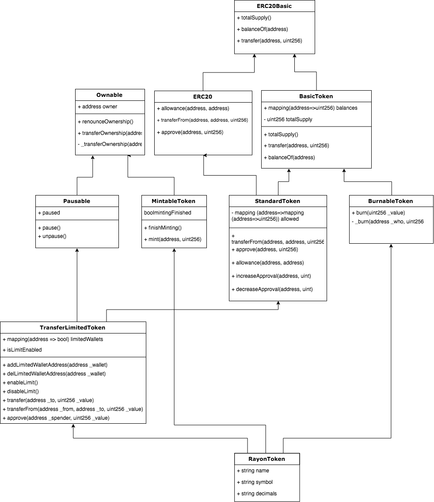
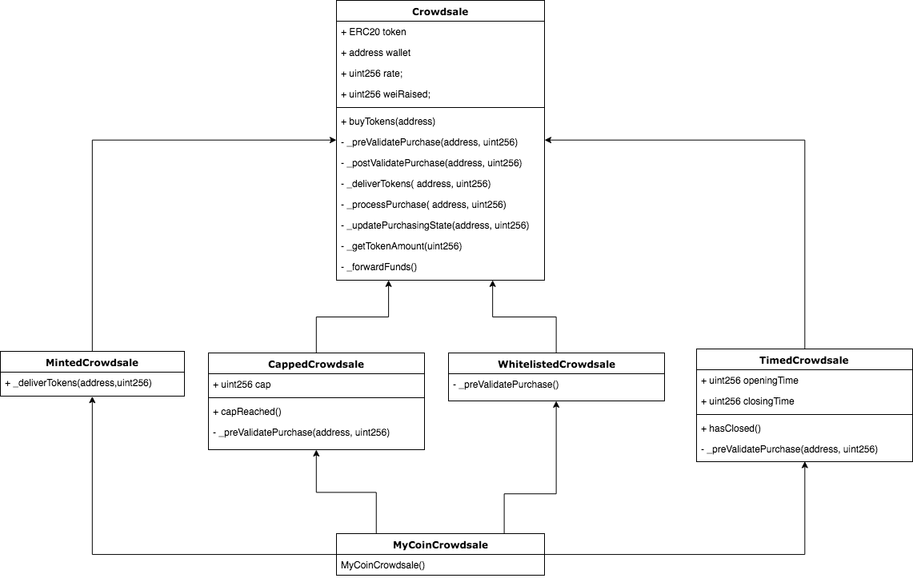

# RayonProtocol ICO 

This is RayonProtocol's ICO [Smart Contracts](https://en.wikipedia.org/wiki/Smart_contract) prototype based on ERC20, using [OpenZeppelin](https://github.com/OpenZeppelin/), [TokenMarketNet](https://github.com/TokenMarketNet) and [DAICO](https://github.com/theabyssportal/DAICO-Smart-Contract). 

## About

### [Requirements](https://findainc.atlassian.net/wiki/spaces/BLOC/pages/322240835/23.+Token+ICO)

### RayonToken Architecture


### RayonTokenCrowdsale Architecture


### Getting Started
#### Installing
- Complete `.env.example` file to set enviroment variables used for truffle configuration

#### Running the tests
```bash
# test smart contracts
yarn test 

# test coverage
yarn coverage # generate coverage reports
open coverage/index.html # open reports
```

#### Deployment
```bash
# deploy to development network
yarn migrate:dev
```

#### Flatten contracts
In order to register smart contract code on [Etherscan](https://etherscan.io/), flattening is required.

Install [solidity-flattener](https://github.com/BlockCatIO/solidity-flattener) first.
And then,

```bash
# flatten contracts
yarn flatten

# solidity compiler version
yarn truffle version
```

#### More
See [package.json](package.json) to find out more commands

## Built With
* [Truffle](https://truffleframework.com/) - Ethereum Smart Contract Framework
* [Solidity](https://github.com/ethereum/solidity) - Used to develop the Reverse Inquiry smart contracts
* [OpenZeppelin](https://github.com/OpenZeppelin/) - Provides basic token and crowdsale functionality based on smart contracts on Ethereum

## Acknowledgments
* Kindly note that this is a prototype and additional functions with regards to the ICO process will be added.
